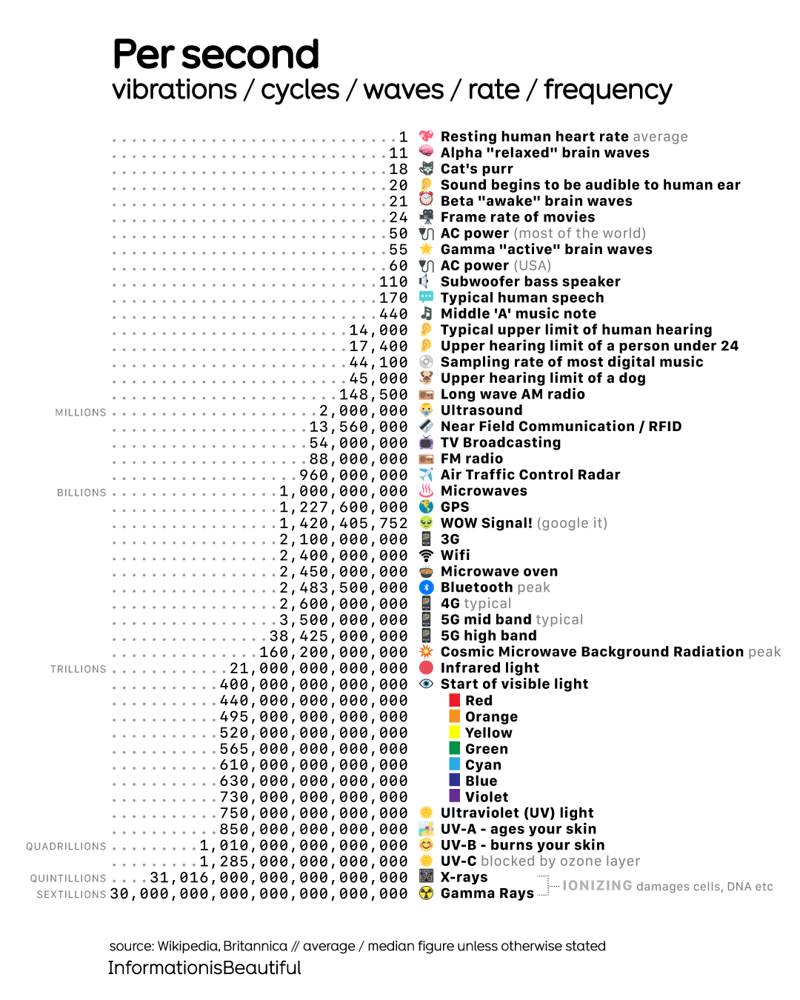

# My Data Visualization Redesign Journey: From "Per Second" to a Clear Frequency Spectrum

## Discovery and Initial Reactions

Browsing through [MakeoverMonday](https://makeovermonday.co.uk/)'s collection of visualization challenges, I stumbled upon an article titled "[Per Second](https://informationisbeautiful.net/2024/per-second-vibrations-cycles-waves-rate-frequency/)." What immediately caught my eye wasn't the content, but the visual pattern—this pyramid-like shape created by cascading zeros in the frequency numbers. As someone who loves diving into data patterns, I knew there was potential here, but I also sensed something was fundamentally wrong with how the information was being communicated.

My first instinct was right. The more I stared at this visualization, the more confused I became. Why was it called "Per Second"? What did vibrations, cycles, waves, rates, and frequencies all have to do with each other? I found myself working hard to connect "sound audible to human ear" with "beta awake brain waves," wondering why they weren't grouped in any logical way.

This initial confusion became my North Star—if I, someone comfortable with data, was struggling this much, imagine how a general audience would feel.

## Critique - Breaking Down What Wasn't Working

I decided to approach this methodically, critiquing each element:

**The Title:** "Per Second" told me nothing. I spent some time trying to decode what the visualization was actually about instead of learning from it. This led me to realize that a good title should immediately orient the viewer—it shouldn't be a puzzle to solve.

**The Description:** Fifty different items thrown together with no apparent logic beyond ascending frequency order. "Sound audible to human ear" appeared miles away from "typical human speech" in the list, even though they're clearly related. The emoji scattered throughout felt like digital confetti—more distracting than helpful. This made me think about the importance of categorization and visual hierarchy.

**The Number:** Those beautiful zeros that first attracted me became the visualization's biggest weakness. After "Microwave (1 Billion waves per second)," I lost all ability to comprehend the scale. 10^18, 10^21—these numbers became meaningless noise.

These critiques crystallized a key insight: **accessibility over visual appeal**. The pyramid shape was interesting, but if readers couldn't understand the content, the visualization failed its primary purpose.

## Sketching and Conceptualizing Solutions

With my critique, I started sketching solutions. My first instinct was to preserve what worked (the ascending frequency concept) while fixing what didn't (the readability and organization issues).

**Sketch 1:** I experimented with a linear timeline but realized the frequency range was too vast—biological frequencies would be invisible compared to radiation frequencies.

**Sketch 2:** This led me to logarithmic scaling. Suddenly, I could show the full spectrum without losing the lower frequencies. The circle/dot plot format emerged naturally—it felt cleaner than bars and more appropriate for showing discrete data points across a continuous scale.

**The Categorization:** Looking back at the visualization, I realized I kept mentally grouping related items together. And I realized this was how humans naturally process information. I identified seven logical categories:

- Biological & Physiological (our bodies)
- Power & Technology (electrical systems)
- Sound & Audio (what we hear)
- Radio & Broadcasting (communication)
- Wireless & Cellular (modern connectivity)
- Light & Optical Spectrum (what we see)
- High-Energy Radiation (the dangerous stuff)

This categorization approach felt like a crucial insight. Now readers could understand not just *what* these frequencies were, but *how they related to their lives*.

## First Digital Prototype

Moving into Tableau, I faced my first technical reality check. Logarithmic scales in Tableau behave differently than I expected—I couldn't customize the axis labels the way I wanted. But I pushed forward with my core concept:

- **Title change:** "A Guide to the Frequency Spectrum" - much clearer than "Per Second"
- **Color coding:** Different colors for each category
- **Tooltips:** Detailed information on hover to keep the main view clean
- **Maintained ascending order:** Preserved the pyramid concept while adding logical groupings

Here's my first prototype made by Tableau: (_Tableau's display might look different on different platform or different display monitors._)

    <noscript>
        
    </noscript>
    <object class='tableauViz' style='display:none;'>
        <param name='host_url' value='https://public.tableau.com/' />
        <param name='embed_code_version' value='3' />
        <param name='site_root' value='' />
        <param name='name' value='assignment2graph_17579782885820/Sheet1' />
        <param name='tabs' value='no' />
        <param name='toolbar' value='yes' />
        <param name='static_image' value='https://public.tableau.com/static/images/as/assignment2graph_17579782885820/Sheet1/1.png' />
        <param name='animate_transition' value='yes' />
        <param name='display_static_image' value='yes' />
        <param name='display_spinner' value='yes' />
        <param name='display_overlay' value='yes' />
        <param name='display_count' value='yes' />
        <param name='language' value='en-US' />
        <param name='filter' value='publish=yes' />
    </object>

## User Feedback - The Reality Check

**Brian's Feedback:**

_Brian, CMU MISM_

Watching Brian interact with my visualization provided valuable insights. His first action—clicking the title—told me he understood the purpose immediately. When he described the content, he naturally used my category groupings rather than listing individual items. This validated my categorization approach.

But then came the surprise: *"It is surprising that it's not 100% hierarchical, for ultrasound scanner is much higher than the category of sound & audio."*

This observation was particularly striking. Brian expected perfect hierarchical order within categories, but real-world data doesn't always cooperate. Some ultrasound frequencies are indeed higher than radio frequencies. This taught me that **user expectations don't always align with data reality**—and I needed to decide whether to prioritize data accuracy or user intuition.

Brian's design critiques were equally eye-opening:

- "The color coding... are in different shades of red" - I hadn't even noticed I was using a monochromatic scheme
- "I don't think the legends are needed" - He was right; they were redundant
- "I find it weird that I have to scroll down" - The full spectrum wasn't visible at once

**Classmate Feedback:**

_Classmates, CMU_

My classmates brought additional perspectives:

- The title could be even more informative
- Some expected descending order (highest to lowest frequencies)
- The scientific notation on the X-axis was hard to interpret

## Incorporating Feedback - The Refinement Process

With the feedbacks, I had to weigh them against my design goals and the data's constraints.

**Changes I Made:**

- **New title:** "The Complete Frequency Spectrum by Hertz (1/Second)" with subtitle "Biological, technological, and electromagnetic phenomena across the frequency spectrum" - Much more informative while defining the unit
- **Color scheme overhaul:** Distinct colors for each category, removed redundant legend
- **View adjustment:** Made the entire visualization visible without scrolling, even though this compressed the spacing

**Changes I Resisted (and why):**

- **Kept ascending order:** I decided data accuracy trumped some user expectations. Starting with biological frequencies (heartbeat, brainwaves) gives readers a relatable entry point
- **Kept scientific notation:** Tableau's limitation doesn't allow me to custom the axis with logarithmic scale.

Here's the final result ((_Tableau's display might look different on different platform or different display monitors._)):

    <noscript>
        
    </noscript>
    <object class='tableauViz' style='display:none;'>
        <param name='host_url' value='https://public.tableau.com/' />
        <param name='embed_code_version' value='3' />
        <param name='site_root' value='' />
        <param name='name' value='TheCompleteFrequencySpectrum/Sheet1' />
        <param name='tabs' value='no' />
        <param name='toolbar' value='yes' />
        <param name='static_image' value='https://public.tableau.com/static/images/Th/TheCompleteFrequencySpectrum/Sheet1/1.png' />
        <param name='animate_transition' value='yes' />
        <param name='display_static_image' value='yes' />
        <param name='display_spinner' value='yes' />
        <param name='display_overlay' value='yes' />
        <param name='display_count' value='yes' />
        <param name='language' value='en-US' />
    </object>

## Final Reflection - What I Learned

My final visualization shows the complete electromagnetic and mechanical frequency spectrum organized by seven meaningful categories, displayed on a logarithmic scale that makes the vast range comprehensible.

**Why I chose this approach:**

- **Circle plot:** Clean, allows precise reading of values, works well with logarithmic scaling
- **Categorical color coding:** Helps users understand relationships between phenomena
- **Ascending frequency order:** Starts with familiar biological references, builds up to exotic radiation
- **Tooltips:** Keeps the main view clean while providing detailed information on demand

**What it shows differently:**
Instead of a confusing list of random phenomena, users now see a structured journey through the frequency spectrum. They can understand that their heartbeat, their WiFi, and gamma rays are all part of the same fundamental concept—just at vastly different frequency.

## AI Acknowledgment
- I used Gemini to help me correctly categorize the descriptions into seven categories.
- I used AI to correct my grammar and the flow of the entire document after providing my original script.